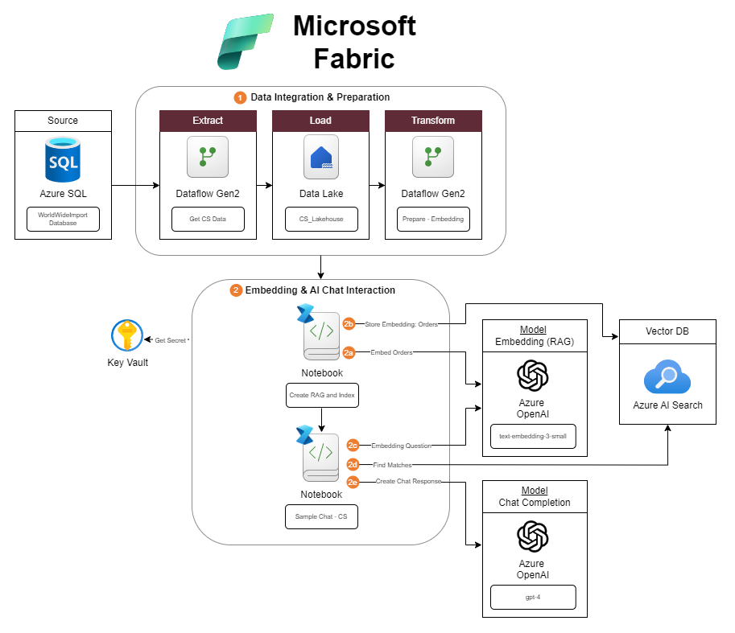

# Microsoft Fabric - Using Dataflow Gen 2 and Data Science to create AI Chatbot

The purpose of this article is to provide the setup instructions for the recorded demo. The presentation and demo includes:

* Introduction to Microsoft Fabric.
* Explore how to prepare data for AI Application using Dataflow Gen 2.
* Dive into the process of transforming your data into knowledge using Retrieval-Augmented Generation (RAG).
* Leverage SynapseML with Azure OpenAI and AI Search to enable chat interactions.
* Demo: Create an end-to-end solution using Microsoft Fabric to create an intelligent chat application.

After this session, you will be able to use Microsoft Fabric and Azure AI services to transform your data into AI ready chat application.

## Video

YouTube - Dear Azure - Building an AI-Powered Chat Application using Microsoft Fabric | Azure OpenAI | SynapseML

* [Part 1 - Integrate and Prepare data using Dataflow Gen 2](https://youtu.be/G-ekRgde5Oo?list=PLd5EI5E5dBo5Pj2v10QN_orpbY7QBYQxF)
* [Part 2 - Create embedding and chat interaction using SynpaseML | Azure Open AI | AI Search](https://youtu.be/ge6zJH8uNxQ?list=PLd5EI5E5dBo5Pj2v10QN_orpbY7QBYQxF) 

## Setup

### Pre-req

For this demo, we require:
| Services | Detail | Documentation |
| --- | --- | --- |
| Microsoft Fabric | Using Azure Fabric Capacity with F64 SKU | [Link](https://learn.microsoft.com/en-us/fabric/admin/capacity-settings?tabs=fabric-capacity&wt.mc_id=MVP_365600) |
| Azure SQL Database | Basic DTU Tier | [Link](https://learn.microsoft.com/en-us/azure/azure-sql/database/single-database-create-quickstart?view=azuresql&tabs=azure-portal&wt.mc_id=MVP_365600)
| Azure OpenAI | Deploy text-embedding-3-small and gpt-4 models | [Link](https://learn.microsoft.com/en-us/azure/ai-services/openai/how-to/create-resource?pivots=web-portal&wt.mc_id=MVP_365600) |
| Azure AI Search | Setup with Basic Pricing tier | [Link](https://learn.microsoft.com/en-us/azure/search/search-create-service-portal?wt.mc_id=MVP_365600) |
| Azure Key Vault | Stored the secret for Azure OpenAI and AI Search keys | [Create](https://learn.microsoft.com/en-us/azure/key-vault/general/quick-create-portal?wt.mc_id=MVP_365600), [Add Secret](https://learn.microsoft.com/en-us/azure/key-vault/secrets/quick-create-portal?wt.mc_id=MVP_365600) |

### Integration

  

### Bonus Points

You can utilize the Playground Chat in Azure OpenAI Studio to get a full chat experience. To do so, please follow the instruction here: [link](https://learn.microsoft.com/en-us/azure/ai-services/openai/concepts/use-your-data?tabs=ai-search%2Ccopilot?wt.mc_id=MVP_365600).

## Code and scripts

| Folder/file | Description |
| --- | --- |
| [Demo Sales database](../../../demo-test/test-data/WideWorldImporters/demo-data-202405.sql) | Demo Sales Orders and OrderLines tables. This script include the table creation and insert statements. Please note that the schema and table name have changed to Demo.Sales_202405 and Demo.SaleLines_202405. |
| [Demo 1 - Get and Prepare data - Dataflow Gen2](./src/DataflowGen2-template/) | To import the Dataflow Gen2, please follow the [instruction](https://learn.microsoft.com/en-us/fabric/data-factory/move-dataflow-gen1-to-dataflow-gen2?wt.mc_id=MVP_365600) starting at step 5.|
| [Demo 2 - Embedding data and AI-Chat interaction](./src/Notebook/) | To import the Notebook, please follow the [instruction](https://learn.microsoft.com/en-us/fabric/data-engineering/how-to-use-notebook#import-existing-notebooks?wt.mc_id=MVP_365600) |
