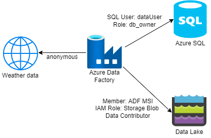

# Azure Data Factory - Data Pipeline demo
The purpose of this article is to provide the setup instructions for the recorded demo. The presentation and demo includes: 
- Overview of the main components of Azure Data Factory
- How to design a data pipeline?
- A demo of building an end-to-end data pipeline:
    - Ingest data into a data lake.
    - Joining and transforming data using Mapping data flow.
    - Debug a data pipeline.
    - Create a schedule trigger for the data pipeline.

In the end, you will be ready to create your own data pipelines in Azure Data Factory. 

## Video
Link: [Youtube - Dear Azure - Azure Data Factory best practices | Create data pipeline using Mapping Data flow ](https://youtu.be/9Q8aumWk9Ww)

## Setup
### Pre-req
In this demo, we are using 4 Azure resources: 
1. Azure Data Factory (ADF)
1. Azure SQL Database
1. Azure Key Vault
1. Azure Storage with hierarchical namespace enabled (Data Lake gen 2)  

### Integration

| Azure Service | Permission |
| --- | --- |
| Azure SQL | SQL User: dataUser, DB Role: db_owner |
| Key Vault | Member: ADF MSI, IAM Role: Key Vault Secret User |
| Data Lake | Member: ADF MSI, IAM Role: Storage Blob Data Contributor |
| Weather Data (HTTP) | anonymous - Generated SAS token |

Note: Key Vault was not used in the demo. This was added for the CI/CD demo.

## Code and scripts
| Folder/file | Description |
| --- | --- |
| adf-code | The folder contains all the ADF JSON code. You need to make changes to the Linked services using your Azure resources. |
| create-db-objects/create-login-master.sql | This script creates the dataUser in the master database in Azure SQL. Run this before the create_db_objects.sql file |
| create-db-objects/create_db_objects.sql | This script creates all the required objects in the demo. This needs to be ran in the SQL database. |
| sample-data/Sample.SalesInvoices.Table.sql | This script contains the insert statements for SalesInvoice table. |
| sample-data/Sample.SalesInvoiceLines.Table.sql | This script contains the insert statements for SalesInvoiceLines table. Please run the SalesInvoice script first. |
| sample-data/weather.json | This is the sample weather data I created. I created a 'weather-data' container in the data lake and generated a SAS token to emulate a file using HTTP endpoint. For security reason, please make sure you setup an expiry date. |
| sql-queries/demo_queries.sql | This file contains the query I ran in the demo to show the result data in the database. |
| Additional steps | Create a secret 'dpsqlserverdemo-dataUser' with the dataUser password in the Key Vault. |

